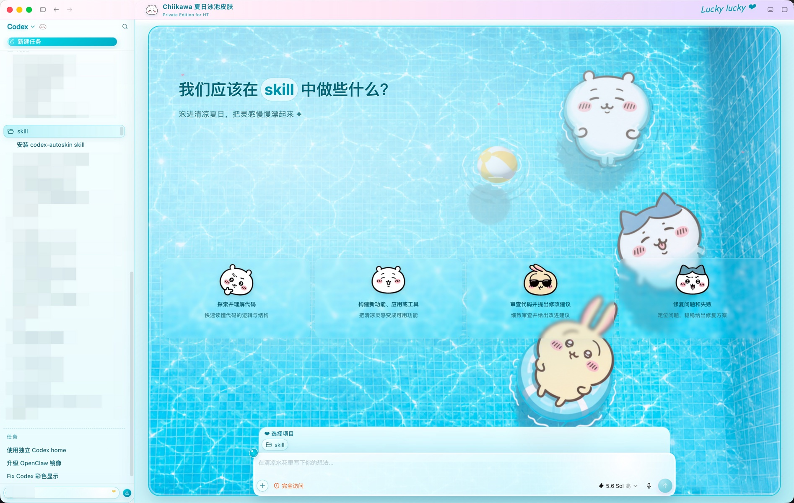

# Chiikawa 夏日泳池 Codex 皮肤

给家人直接安装使用的 Summer 专版。仓库只包含最终主题和安装、自动恢复、卸载所需文件，不包含制皮工具或开发资料。



## macOS：推荐安装方式

1. 安装并打开过一次 Codex。
2. [下载最新版 ZIP](https://github.com/Jiaranbb/codex-autoskin-chiikawa/archive/refs/heads/master.zip) 并解压。
3. 双击 `Install AutoSkin on macOS.command`。
4. 如果系统阻止打开，请右键该文件并选择“打开”。

主题失效时，重新双击同一个安装文件即可修复。

命令行安装：

```bash
git clone --depth 1 https://github.com/Jiaranbb/codex-autoskin-chiikawa.git
cd codex-autoskin-chiikawa
./scripts/autoskin-macos.sh install
```

## Windows 安装

要求：Windows 10/11、Microsoft Store 版 Codex，以及 Node.js 20 或更高版本。

```powershell
git clone --depth 1 https://github.com/Jiaranbb/codex-autoskin-chiikawa.git
cd codex-autoskin-chiikawa
.\quickstart.ps1
```

主题失效时重新运行 `.\quickstart.ps1`。

## 卸载

macOS：双击 `Uninstall AutoSkin on macOS.command`。

Windows：

```powershell
.\scripts\restore-dream-skin.ps1 -Uninstall -RestoreBaseTheme
```

AutoSkin 不修改 Codex 官方应用包、签名或 `app.asar`，不会替换用户任务、登录状态和插件。自动恢复服务会在 Codex 正常重启后重新应用主题。

## 来源与许可

本项目基于 [Finderchangchang/codex-autoskin](https://github.com/Finderchangchang/codex-autoskin)，引擎代码沿用原项目的 [MIT License](LICENSE)。主题素材说明见 [ASSET-NOTICE.md](ASSET-NOTICE.md)。
